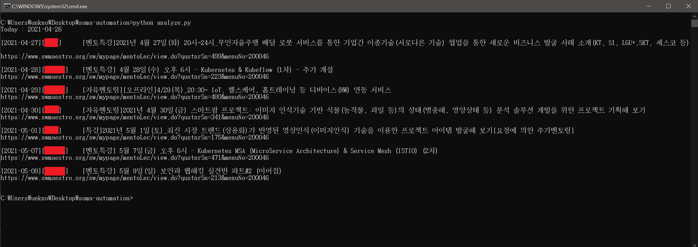

# 소프트웨어 마에스트로 자동화 스크립트

소프트웨어 마에스트로 홈페이지에서 일부 불편한 점을 `python` 스크립트로 자동화했습니다. 제가 이 스크립트를 만든 이유는 신청한 강의를 날짜와 함께 보기 위해서입니다. (소마 홈페이지에서는 자신이 신청한 강의를 강의 날짜 순서대로 정렬해서 보여준다던가, 정확한 강의 날짜를 함께 볼 수 있는 기능을 제공을 하지 않습니다.) 그러나 이 스크립트를 더 확장하여 강의 자동 신청 등 다양한 방법으로 이용이 가능할 거라 생각합니다. 

## 사용법

0. 모든 스크립트를 사용하기에 앞서, 이 리포지토리 안에 다음과 같은 `secrets.json ` 파일을 생성해야 합니다.

```json
["소마 홈페이지 ID", "소마 홈페이지 PW"]
```

1.  `autorun.bat`파일을 실행하시면 자동으로 아래 `python` 스크립트들을 실행해서 본인이 신청한 강의를 강의 날짜, 올린 사람과 함께 보여줍니다. **날짜가 지난 강의는 보여주지 않습니다.** 이미 지난 강의도 보고싶으시다면 `analyze.py`에서 날짜 체크하는 부분을 수정해주세요.
2. `analyze.py` 파일만 실행하면 이전에 크롤링된 결과를 이용해서 정렬된 강의들을 보여줍니다.

## `lecture-all.py`

모든 강의의 목록을 `lecture-all.json`파일에 다음과 같은 형식으로 저장합니다.

```json
[
    {
        "title":"강의명",
        "date":"강의날짜",
        "available":"강의 상태(모집 중, 마감)",
    	"mentor":"올린 사람 이름"
    },
    ...
]
```

## `lecture-mine.py`

내가 신청한 강의의 목록을 `lecture-mine.json`파일에 다음과 같은 형식으로 저장합니다.

```json
[
    {
        "title":"강의명",
        "registered":"신청 완료 / 신청 취소",
    },
    ...
]
```

## `analyze.py`

`lecture-all.json`과 `lecture-mine.json`을 읽어 내가 신청한 강의 중, 취소하지 않은 강의를 다음 형식으로 보여줍니다.

```
[강의 날짜] 강의명
```

## `soma.py`

소마 로그인에 사용되는 라이브러리 모듈로, `login(username, password)` 함수를 실행하면 소마 홈페이지에 로그인된 `requests.Session` 객체를 반환합니다.

## Result



